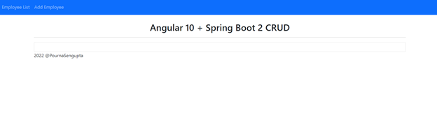
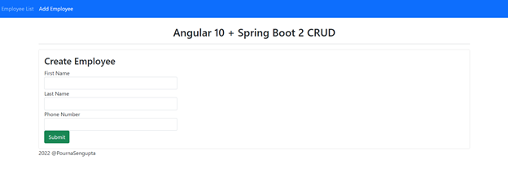
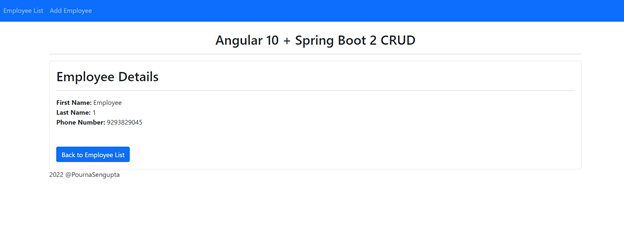
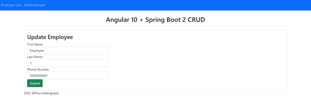
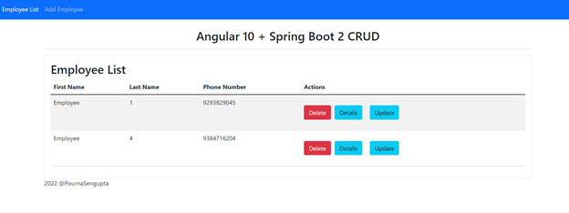

# Spring Boot and Angular 10 CRUD Tutorial 

 ## Overview 
> In this tutorial, a CRUD (Create, Read, Update, and Delete) application using Spring Boot, Angular, and MySQL is created for an Employee Management system. 
> This system tracks Employee Name and Phone Number, but can easily be modified for further components. 
> 
> The full tutorial can be found [here](./AngularSpringBootTraining.pdf)

## Features 
> * Create an Employee 
> * Update an Employee 
> * List Employees 
> * Delete an Employee 
> * View an Employee

##Client and Server 
> The [springboot2-jpa-crud](./springboot2-jpa-crud) directory develops the CRUD RESTful APIs for the Employee Management System using Spring Boot 2, JPA, and MySQL. 
> The [angular10-client](./angular10-springboot-client) directory develops the single page application, using Angular 10 for front end development in this example. This application consumes the CRUD RESTful APIs developed and exposed by the springboot2-jpa-crud project. 

## Tools and Technologies 
> * Spring Boot 
> * JDK 
> * Spring Framework 
> * Hibernate
> * Spring Data JPA

> ### Database 
> MySQL Database 

> ### Front End Technologies 
> * Angular 10
> * Bootstrap 
> * NPM 
> * jQuery 
> * NodeJS

### Tools
> * Maven 
> * IDE - IntelliJ (Spring Boot API)
> * Visual Studio (Angular Application)
> * Angular CLI 10 

## File Directory 
> ### Spring Boot Server
> #### Controller Layer 
>>[controller](./springboot2-jpa-crud/src/main/java/net/guides/springboot2/springboot2jpacrud/controller)
>> * [EmployeeController.java](./springboot2-jpa-crud/src/main/java/net/guides/springboot2/springboot2jpacrud/controller/EmployeeController.java)
>
> #### Exception Handling 
>>[exception](./springboot2-jpa-crud/src/main/java/net/guides/springboot2/springboot2jpacrud/exception)
>> * [ErrorDetails.java](./springboot2-jpa-crud/src/main/java/net/guides/springboot2/springboot2jpacrud/exception/ErrorDetails.java)
>> * [GlobalExceptionHandler.java](./springboot2-jpa-crud/src/main/java/net/guides/springboot2/springboot2jpacrud/exception/GlobalExceptionHandler.java)
>> * [ResourceNotFoundException.java](./springboot2-jpa-crud/src/main/java/net/guides/springboot2/springboot2jpacrud/exception/ResourceNotFoundException.java) 
>
> #### Model Layer
>>[model](./springboot2-jpa-crud/src/main/java/net/guides/springboot2/springboot2jpacrud/model)
>> * [Employee.java](./springboot2-jpa-crud/src/main/java/net/guides/springboot2/springboot2jpacrud/model/employee.java)
>
> #### Repository Layer 
>>[respository](./springboot2-jpa-crud/src/main/java/net/guides/springboot2/springboot2jpacrud/repository)
>> * [EmployeeRepository.java](./springboot2-jpa-crud/src/main/java/net/guides/springboot2/springboot2jpacrud/repository/EmployeeRepository.java)
>
> #### Application Properties 
>> * [application.properties](./springboot2-jpa-crud/src/resources/application.properties)
> 
> #### Spring Boot Application 
>> * [Springboot2JpaCrudApplication.java](./springboot2-jpa-crud/src/main/java/net/guides/springboot2/springboot2jpacrud/Springboot2JpacrudApplication.java)

> ## Employee Management System 
> ### Home Page
> 
> ### Create
> 
> ### Read
> 
> ### Update
> 
> ### Delete
> 
